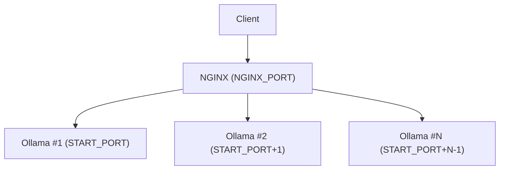

<p align="center">
  
</p>


# Nomic Embedding Load Balancer Docker Image

A ready-to-use, scalable Docker container for running **multiple Ollama instances** (with the `nomic-embed-text` model) behind an **NGINX load balancer**. Perfect for deploying high-throughput embedding services with minimal setup.

---

## 🚀 Overview

This container launches:
- **N Ollama instances** (each running the `nomic-embed-text` model) on consecutive ports
- An **NGINX load balancer** that routes requests to these instances
- **Supervisor** to manage all processes

You control the number of instances and ports via environment variables.

---

## 🏗️ Architecture


```
[Client]
|
v
[NGINX (NGINX_PORT)]
|
+--> [Ollama #1 (START_PORT)]
+--> [Ollama #2 (START_PORT+1)]
...
+--> [Ollama #N (START_PORT+N-1)]
```

---

- All Ollama instances run the `nomic-embed-text` model
- NGINX load balances requests using the least-connections policy

---

## ⚙️ Environment Variables

| Variable         | Default  | Description                                                      |
|------------------|----------|------------------------------------------------------------------|
| `NUM_INSTANCES`  | `6`      | Number of Ollama instances to start                              |
| `START_PORT`     | `11001`  | First port for Ollama instances (next instances use +1, +2, ...) |
| `NGINX_PORT`     | `11000`  | Port for NGINX load balancer (exposed to host)                   |

---

## 🧑‍💻 Usage Examples

### 1. **Basic Usage (6 instances, default ports)**
```bash
docker run -d -p 11000:11000 \
  --name nomic-lb \
  saketkr1/nomic-embedding-lb:latest
```
- NGINX listens on port 11000
- Ollama runs on ports 11001–11006

### 2. **Custom Number of Instances**
```bash
docker run -d -p 11000:11000 \
  -e NUM_INSTANCES=4 \
  --name nomic-lb-4 \
  saketkr1/nomic-embedding-lb:latest
```
- 4 Ollama instances (ports 11001–11004)

### 3. **Custom Starting Port for Ollama**
```bash
docker run -d -p 11000:11000 \
  -e NUM_INSTANCES=3 \
  -e START_PORT=12001 \
  --name nomic-lb-custom-port \
  saketkr1/nomic-embedding-lb:latest
```
- Ollama runs on ports 12001–12003

### 4. **Custom NGINX Port**
```bash
docker run -d -p 8080:8080 \
  -e NGINX_PORT=8080 \
  --name nomic-lb-nginx8080 \
  saketkr1/nomic-embedding-lb:latest
```
- NGINX listens on port 8080

### 5. **All Customizations Together**
```bash
docker run -d -p 9000:9000 \
  -e NUM_INSTANCES=8 \
  -e START_PORT=13001 \
  -e NGINX_PORT=9000 \
  --name your-own-balanced-nomic \
  saketkr1/nomic-embedding-lb:latest
```
- 8 Ollama instances (ports 13001–13008), NGINX on 9000

---

## 🔬 Testing the Service

After starting the container, test the embedding endpoint:

**With curl:**
```bash
curl http://localhost:11000/api/embeddings \
  -H "Content-Type: application/json" \
  -d '{"model": "nomic-embed-text", "prompt": "test embedding"}'
```

**With Python:**
```python
import requests
response = requests.post('http://localhost:11000/api/embeddings',
  json={'model': 'nomic-embed-text', 'prompt': 'test embedding'})
print(response.json())
```

---

## 🛠️ Advanced: Docker Compose (Local Dev)

```bash
docker-compose up -d
```
- Edit `docker-compose.yml` to set instance count, ports, etc.

---

## 📋 Logs & Troubleshooting

- View logs: `docker logs <container_name>`
- Check health: `docker ps`
- Stop: `docker stop <container_name>`
- Remove: `docker rm <container_name>`

If you see errors about ports, make sure the ports are free on your host.

---

## ❓ FAQ

- **Q: How much RAM do I need?**
  - Each Ollama instance uses ~2–4GB RAM. Plan accordingly.
- **Q: How do I change the model?**
  - This image is pre-configured for `nomic-embed-text`. For other models, you’ll need to modify the image.
- **Q: Can I use this in production?**
  - Yes! Just set the environment variables and port mappings as needed.

---

## 🏷️ Image Info
- Docker Hub: [`saketkr1/nomic-embedding-lb`](https://hub.docker.com/r/saketkr1/nomic-embedding-lb)
- Maintainer: [`saketkr1`](https://hub.docker.com/u/saketkr1)
- GitHub: [`Saket-Kr`](https://github.com/Saket-Kr)


---

Happy embedding! 🚀 
