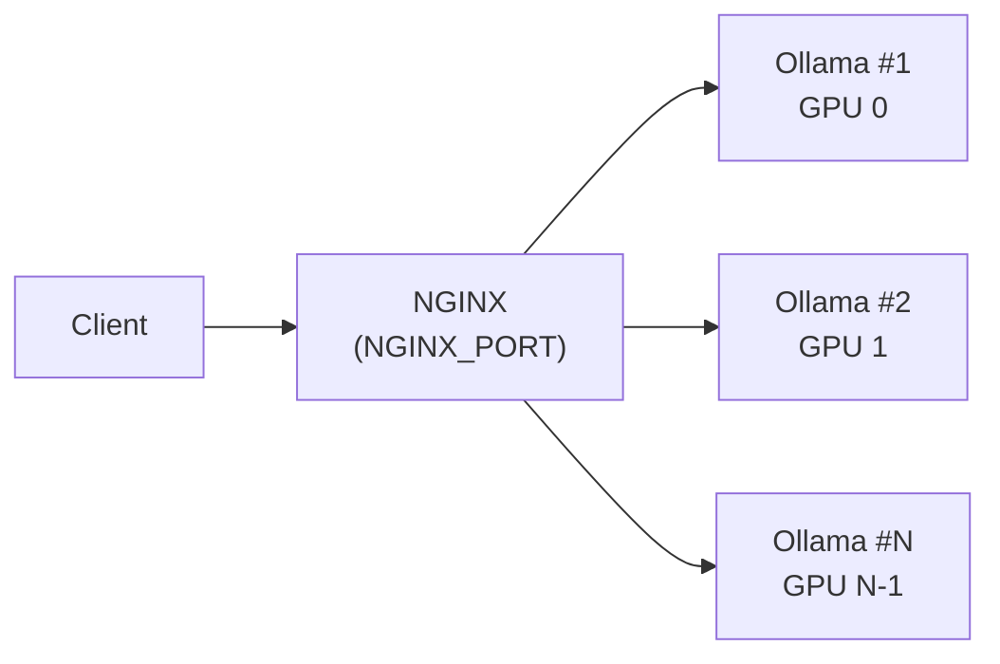

<p align="center">
  
</p>

# Nomic Embedding Load Balancer

A drop-in Docker image for running the `nomic-embed-text` model as a load-balanced, **GPU-accelerated** embedding service. Built on the official `ollama/ollama` image, with NGINX routing requests across one Ollama instance per GPU.

One `docker run` and you have an embedding endpoint on `:11000` that scales with the number of GPUs you give it.

## ✨ Features

- **GPU-accelerated out of the box** — uses CUDA when the container gets GPUs, falls back to CPU otherwise
- **Linear multi-GPU scaling** — each Ollama instance is pinned to a distinct GPU via `CUDA_VISIBLE_DEVICES`; set `NUM_INSTANCES` equal to your GPU count for parallel inference
- **Production-ready** — NGINX load balancing (least-connections), supervisor-managed processes, Docker healthcheck
- **Reproducible** — pinned `ollama/ollama:0.21.0` base image; no drifting install scripts
- **Zero-config** — sensible defaults; override with environment variables

## 🚀 Quickstart

**Single GPU (or CPU fallback):**
```bash
docker run -d --gpus all -p 11000:11000 \
  --name nomic-lb saketkr1/nomic-embedding-lb:latest
```

**Two GPUs:**
```bash
docker run -d --gpus all -p 11000:11000 \
  -e NUM_INSTANCES=2 \
  --name nomic-lb saketkr1/nomic-embedding-lb:latest
```

Then hit it:
```bash
curl http://localhost:11000/api/embeddings \
  -H "Content-Type: application/json" \
  -d '{"model": "nomic-embed-text", "prompt": "test embedding"}'
```

## 📋 Prerequisites

- **Docker** (24+ recommended)
- **For GPU**: [NVIDIA Container Toolkit](https://docs.nvidia.com/datacenter/cloud-native/container-toolkit/latest/install-guide.html) installed on the host, so `--gpus all` works
- **CPU-only works too** — just drop `--gpus all`

---

## 🏗️ Architecture


```mermaid
flowchart LR
    Client["Client"]
    NGINX["NGINX<br/>(NGINX_PORT)"]
    O1["Ollama #1<br/>GPU 0"]
    O2["Ollama #2<br/>GPU 1"]
    ON["Ollama #N<br/>GPU N-1"]

    Client --> NGINX
    NGINX --> O1
    NGINX --> O2
    NGINX --> ON
```

- All Ollama instances run the `nomic-embed-text` model
- NGINX load-balances requests using the least-connections policy
- **Each instance is pinned to one GPU** via `CUDA_VISIBLE_DEVICES` (instance `i` → GPU `i`), so `NUM_INSTANCES=N` on a host with N GPUs uses all of them in parallel

---

## 🎯 Sizing `NUM_INSTANCES`

Rule of thumb: **one instance per GPU**.

| Hardware | Recommended `NUM_INSTANCES` | Effective throughput |
|---|---|---|
| 1 GPU | `1` | 1× (nginx is a passthrough) |
| N GPUs | `N` | ~N× (nginx least-connections distributes across GPUs) |
| CPU-only | `1`–`cores/2` | Scales with cores; GPU benefits do not apply |

Running more instances than GPUs doesn't help — extra instances land on CPU (no free GPU assigned) and share memory with the rest.

---

## ⚙️ Environment Variables

| Variable         | Default  | Description                                                      |
|------------------|----------|------------------------------------------------------------------|
| `NUM_INSTANCES`  | `1`      | Number of Ollama instances. Set this to your GPU count for multi-GPU scaling. |
| `START_PORT`     | `11001`  | First internal port for Ollama instances (next use +1, +2, …)    |
| `NGINX_PORT`     | `11000`  | Port NGINX exposes to the host                                   |

---

## 🧑‍💻 Usage Patterns

Beyond the Quickstart, mix and match the environment variables above. A few common patterns:

**Custom ports** (host firewall restricts the defaults):
```bash
docker run -d --gpus all -p 8080:8080 \
  -e NUM_INSTANCES=1 -e NGINX_PORT=8080 \
  --name nomic-lb saketkr1/nomic-embedding-lb:latest
```

**Docker Compose** (local dev):
```bash
docker-compose up -d
```
Edit `docker-compose.yml` to adjust instance count, ports, and GPU passthrough.

**Python client:**
```python
import requests
response = requests.post('http://localhost:11000/api/embeddings',
  json={'model': 'nomic-embed-text', 'prompt': 'test embedding'})
print(response.json()['embedding'])
```

---

## 📋 Logs & Troubleshooting

- **View logs**: `docker logs <container_name>`
- **Check health**: `docker ps` (look for the `healthy` status)
- **Stop / remove**: `docker stop <name>` / `docker rm <name>`
- **Port already in use**: free the host port or override `NGINX_PORT`
- **GPU not detected**: verify the NVIDIA Container Toolkit is installed on the host and `docker run --rm --gpus all nvidia/cuda:12.2.0-base-ubuntu22.04 nvidia-smi` works

---

## 🔧 Building the Image Yourself

The published image is `linux/amd64` (standard for GPU hosts). To build locally:

```bash
# Build & push to your registry
./build_and_push.sh -u <your-dockerhub-username> -t latest

# Build only, no push
./build_and_push.sh -u <your-dockerhub-username> -b
```

The script supports multi-arch builds via `docker buildx`. See the script for the full options.

---

## ❓ FAQ

- **Q: How much memory do I need?**
  - On GPU, `nomic-embed-text` uses under 1 GB of VRAM per instance. On CPU, each instance uses ~2–4 GB of system RAM.
- **Q: Does it fall back to CPU if I don't pass `--gpus`?**
  - Yes. The underlying `ollama/ollama` image detects the GPU at runtime; without one, it runs on CPU (noticeably slower).
- **Q: How do I change the model?**
  - This image is pre-configured for `nomic-embed-text`. For other models, you'll need to modify `set_up_ollama.sh` and rebuild.
- **Q: Can I use this in production?**
  - Yes. Set the environment variables and port mappings as needed, and run with `--restart unless-stopped` for auto-recovery.

---

## 🏷️ Image Info
- Docker Hub: [`saketkr1/nomic-embedding-lb`](https://hub.docker.com/r/saketkr1/nomic-embedding-lb)
- Maintainer: [`saketkr1`](https://hub.docker.com/u/saketkr1)
- GitHub: [`Saket-Kr`](https://github.com/Saket-Kr)

---

Happy embedding! 🚀
